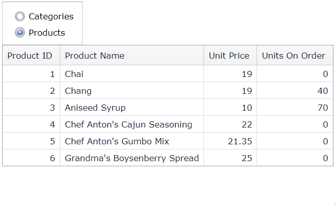

# Grid View for ASP.NET MVC - How to use Ajax callbacks to switch between different data sources (models)
<!-- run online -->
**[[Run Online]](https://codecentral.devexpress.com/t328438/)**
<!-- run online end -->

This example demonstrates how to use the [jQuery.ajax](https://api.jquery.com/jquery.ajax/) function to bind the grid to different data sources on a callback.



## Overview

Add a [RadioButtonList](https://docs.devexpress.com/AspNetMvc/DevExpress.Web.Mvc.RadioButtonListExtension?) editor to your application and configure separate data sources. Handle the editor's `ValueChanged` event and use the [jQuery.ajax](https://api.jquery.com/jquery.ajax/) function to bind the grid to the selected data source on a callback. To identify the data source, use its `ID` property in the corresponding Action method.

```js
function OnValueChanged(s, e) {
    $.ajax({
        url: '@Url.Action("GridViewPartial", "Home")',
        type: "GET",
        data: { gridType: RadioButtonList.GetSelectedItem().text },
        success: function (data) {
            $('#dvContainer').html(data);
        },
        error: function (xhr, textStatus, errorThrown) {
            alert('Request Status: ' + xhr.status + '; Status Text: ' + textStatus + '; Error: ' + errorThrown);
        }
    });
}
```

```cs
public ActionResult GridViewPartial(GridType gridType = GridType.Categories) {
    IEnumerable model = null;

    switch (gridType) {
        case GridType.Categories:
            model = NorthwindDataProvider.GetCategories();
            ViewData["KeyFieldName"] = "CategoryID";
            break;
        case GridType.Products:
            model = NorthwindDataProvider.GetProducts();
            ViewData["KeyFieldName"] = "ProductID";
            break;
    }
    // ...
}
```

## Files to Review

* [HomeController.cs](./CS/Controllers/HomeController.cs) (VB: [HomeController.vb](./VB/Controllers/HomeController.vb))
* [GridViewPartial.cshtml](./CS/Views/Home/GridViewPartial.cshtml)
* [Index.cshtml](./CS/Views/Home/Index.cshtml)

## Documentation

* [Passing Values to a Controller Action through Callbacks](https://docs.devexpress.com/AspNetMvc/9941/common-features/callback-based-functionality/passing-values-to-a-controller-action-through-callbacks)

## More Examples

* [Grid View for ASP.NET Web Forms - How to bind a grid to different data sources at runtime](https://github.com/DevExpress-Examples/aspxgridview-created-at-runtime-switch-data-sources)
* [Grid View for ASP.NET MVC - How to use the jQuery.ajax function with DevExpress MVC extensions](https://github.com/DevExpress-Examples/mvc-gridview-jqueryajax-function)
